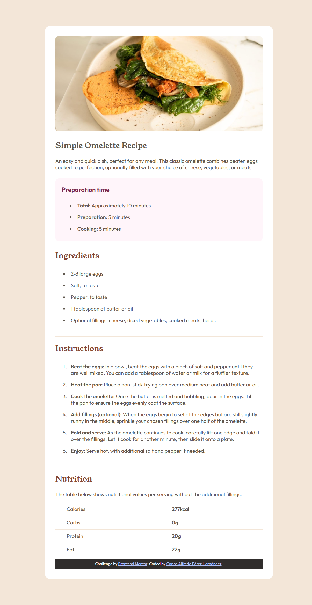

# Frontend Mentor - Recipe page solution

This is a solution to the [Recipe page challenge on Frontend Mentor](https://www.frontendmentor.io/challenges/recipe-page-KiTsR8QQKm). Frontend Mentor challenges help you improve your coding skills by building realistic projects. 

## Table of contents

- [Overview](#overview)
  - [The challenge](#the-challenge)
  - [Screenshot](#screenshot)
  - [Links](#links)
- [My process](#my-process)
  - [Built with](#built-with)
  - [What I learned](#what-i-learned)
  - [Continued development](#continued-development)
  - [Useful resources](#useful-resources)
- [Author](#author)
- [Acknowledgments](#acknowledgments)

**Note: Delete this note and update the table of contents based on what sections you keep.**

## Overview

### Screenshot



### Links

- Solution URL:[https://github.com/CarlosPerez1999/FM-RecipePage]
- Live Site URL:[https://carlosperez1999.github.io/FM-RecipePage/]

## My process

### Built with

- Semantic HTML5 markup
- CSS custom properties
- Flexbox
- Mobile-first workflow

### What I learned
Working on this challenge helped me strengthen key concepts, such as using CSS variables to maintain consistency in colors and fonts, and understanding how organize a design using flexbox


```html
<h1 class="main-tittle">Simple Omelette Recipe</h1>
```
```css
.main-tittle{
    font-family: var(--font-primary);
    font-weight: 400;
    max-lines: 2;
    word-wrap: break-word;
}
```

### Continued development

Improve accessibility: use correct labels 
Responsive optimizations: Implement more media queries to improve the experience on large devices.
CSS good practices: Incorporate methodologies such as BEM for a more structured CSS code.

## Author
- Frontend Mentor - [@yourusername](https://www.frontendmentor.io/profile/CarlosPerez1999)
